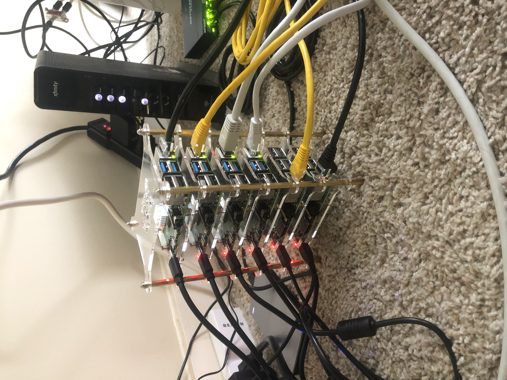

# f(un)*society00
## Operation WulfDoS

[Checkout the Demo](https://www.youtube.com/watch?v=kQaJA66kncU&feature=youtu.be)

Description & Purpose:
  * Operation WulfDoS is an attempt to DDoS attack an intentionally vulnerable linux OS running on Raspberry Pi: [RasPwn](https://raspwn.org/index).
  * WulfDoS uses a Beowulf Cluser to execute a simulated DDoS Attack on the RasPwn SSID.
  * Knowledge obtained from Operation WulfDoS:
    - Better understanding TCP vs UDP
    - How to Build a HPC cluster
    - How to perform a DoS attack (TCP & UDP)
    - Cores vs. Threads
    - Hyperthreading

Main Functionality: Execute DoS attack scripts across a 6-pi Beowulf Cluster simulating DDoS on victim RasPwn server

Technical Specifications:
  * Hardware:
    - 3x Raspberry Pi 3
    - 5x Raspberry Pi 4
    - 1x 2TB Seagate External Harddrive
    - 1x Netgear multi-port ethernet splitter
    - 1x Raspberry Pi Tower Case

  * Software:
    - Linux
    - Raspbian Lite (Debian CLI)
  * Packages:
    - Slurm (Slurmd, Slurm-Client, Slurmctl)
    - Munge
    - NFS Kernel Server
    - Sockets
    - NTPUpdate
  * Programming Languages:
    - Python 
    - Bash/Shell Scripting

## WulfDoS: the packet flood is coming...

